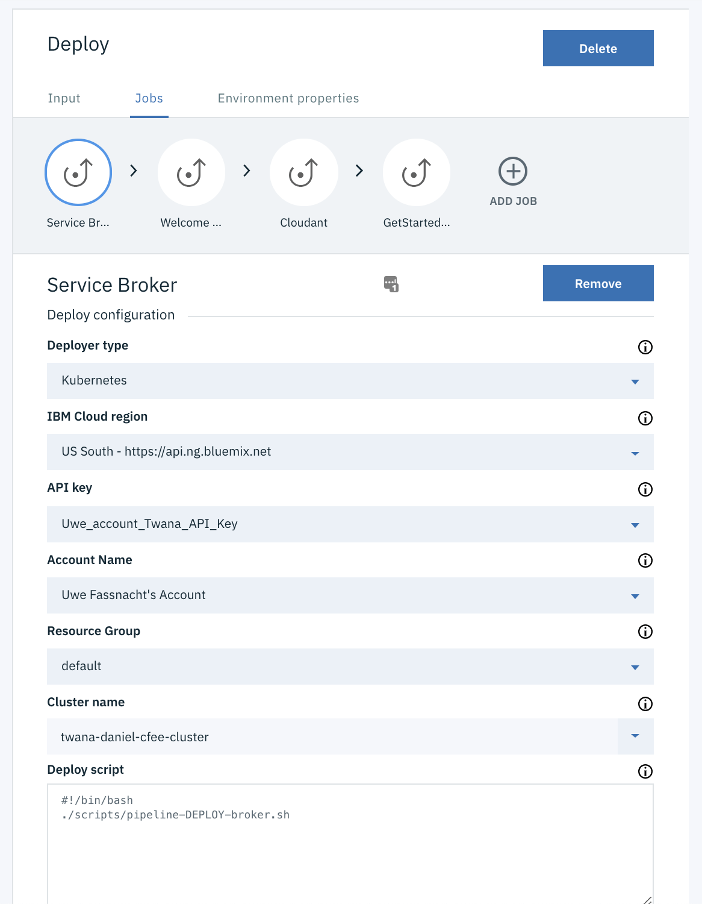
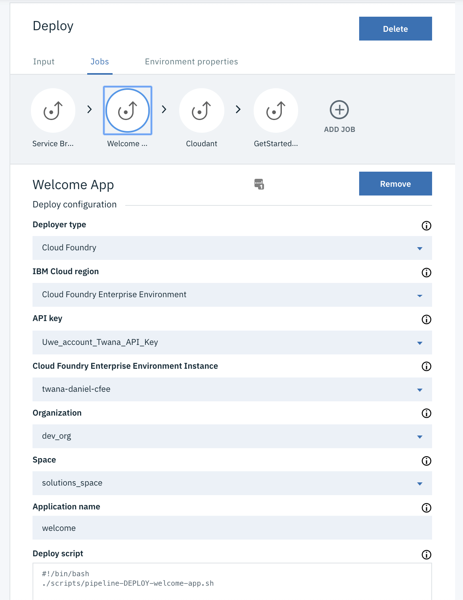
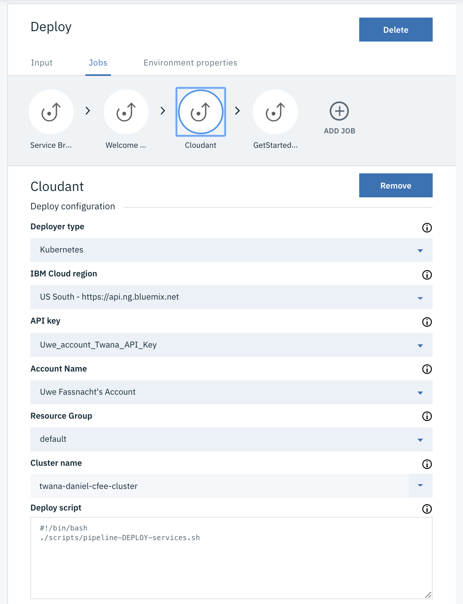
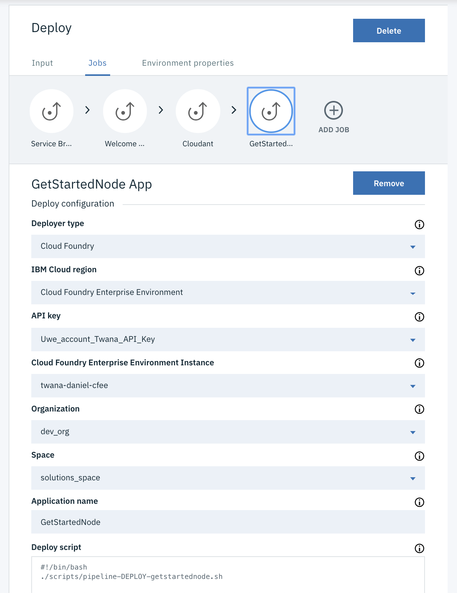

# CFEE Service Broker on Kubernetes

This repository is a companion to the Isolated Cloud Foundry Enterprise Environment (CFEE) solution tutorial. It will deploy a Node.js service broker to an IBM Kubernetes Service cluster. A Cloudant database service, and a [get-started-node](https://github.com/IBM-Cloud/get-started-node) app.

The toolchain deploys the complete solution tutorial, assuming you have pre-created a CFEE instance and have created an org and space within CFEE.

Refer to this [solution tutorial](https://cloud.ibm.com/docs/tutorials?topic=solution-tutorials-isolated-cloud-foundry-enterprise-apps) for detailed instructions. 

## Deploy with a toolchain

This project comes with a partially automated toolchain capable of deploying the service broker and service to IBM Cloud, create a Cloudant database service, deploy the get-started-node sample and bind Cloudant service to the get started sample app. 

### Prerequisites

1. Create a [Cloud Foundry Enterprise Environment](https://cloud.ibm.com/cfadmin/create) service instance.
2. A CFEE org and space name will be needed for the toolchain. Create them using the instructions below.
    ```sh
    ibmcloud target --cf
    <choose your CFEE instance name>
    ibmcloud cf create-org cfee-tutorial
    ibmcloud target -o cfee-tutorial
    ibmcloud cf create-space dev
    ibmcloud target -s dev
    ```

### And then

[](https://cloud.ibm.com/devops/setup/deploy/?repository=https%3A//github.com/IBM-Cloud/cfee-service-broker-kubernetes)

Once the toolchain has completed: 
- The application will be available at `https://getstartednode.<your-cluster-ingress-domain>`.
- The service broker will be available at `https://welcome.<your-cluster-ingress-domain>`.

The following artifacts will be available and created.

| Artifact | Description |
| -------- | ----------- |
| Service Broker | Provides an additional mock service to the Cloud Foundry marketplace in CFEE |
| Welcome Service | Sample service that provides welcome text in several languages |
| Cloudant | Cloudant used by the GetStartedNode |
| GetStartedNode | Modified [get-started-node](https://github.com/IBM-Cloud/get-started-node) app using the Welcome Service |

The toolchain consists of four deployment stages, each with a pipeline DEPLOY [script](https://github.com/IBM-Cloud/cfee-service-broker-kubernetes/tree/master/scripts).

1. Deploy Broker, a Kubernetes deployment type to deploy the service broker.
2. Welcome App, the welcome app deployed to CFEE using the service broker to translate a welcome word randomly.
3. Cloudant service deployment.
4. GetStartedNode sample app. 

## Usage

See the [solution tutorial](https://cloud.ibm.com/docs/tutorials?topic=solution-tutorials-isolated-cloud-foundry-enterprise-apps) for manual steps.